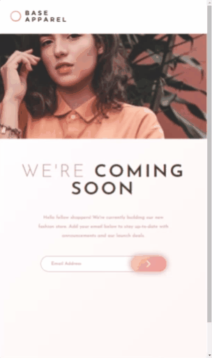

# Frontend Mentor - Base Apparel coming soon page

#### Base Apparel coming soon page é um desafio do Frontend Mentor que consiste em uma landing page simples com validação de email usando javascript. Obrigado por conferir meu código.

## Índice

- [Captura de tela](#captura-de-tela)
- [Links](#links)
- [Construído com](#construído-com)
- [O que aprendi](#o-que-aprendi)
- [Desenvolvimento contínuo](#desenvolvimento-contínuo)
- [Recursos úteis](#recursos-úteis)
- [Fernando Mendes](#autor)

### Captura de tela

#### Tela Desktop


#### Tela Ipad



#### Tela Mobile


### Links

- Site URL: https://nandosti.github.io/advice-generator-app/

### Construído com

<div style="display: inline_block"><br>
  
  
         
</div>

## O que aprendi

Nesse projeto envolvendo HTML,CSS e JS, aprendi conceitos importantes: selecionar elementos DOM; selecionar elementos HTML; evento de envio de formulário; evitar o comportamento padrão de envio de formulário; validação de email; uso de expressão regular de validação de email; conceitos de estilização e responsividade. Uma novidade nos meus projetos é o uso do conceito de "Mobile First".

## Trechos de códigos

```
JS

const form = document.querySelector('.container form');
const email = document.querySelector('.container form input[type=email]');

form.addEventListener('submit', (e) => {
    e.preventDefault();
    let emailValue = email.value;
    if(validateEmail(emailValue)) {
        form.classList.remove('error')
    }else{
        form.classList.add('error')
    }
});

function validateEmail (email) {
    var re = /(?:[a-z0-9+!#$%&'*+/=?^_`{|}~-]+(?:\.[a-z0-9!#$%&'*+/=?^_`{|}~-]+)*|"(?:[\x01-\x08\x0b\x0c\x0e-\x1f\x21\x23-\x5b\x5d-\x7f]|\\[\x01-\x09\x0b\x0c\x0e-\x7f])*")@(?:(?:[a-z0-9](?:[a-z0-9-]*[a-z0-9])?\.)+[a-z0-9](?:[a-z0-9-]*[a-z0-9])?|\[(?:(?:25[0-5]|2[0-4][0-9]|[01]?[0-9][0-9]?)\.){3}(?:25[0-5]|2[0-4][0-9]|[01]?[0-9][0-9]?|[a-z0-9-]*[a-z0-9]:(?:[\x01-\x08\x0b\x0c\x0e-\x1f\x21-\x5a\x53-\x7f]|\\[\x01-\x09\x0b\x0c\x0e-\x7f])+)\])/

    return re.test(String(email).toLowerCase());
};

```

## Desenvolvimento contínuo

Pretendo continuar focado em construir um conhecimento sólido nessas tecnologias. Ainda há muitos conceitos importantes para serem desenvolvidos. Todos os dias aprendo novos conceitos que são gradativamente adicionados ao meu repertório de ferramentas.

## Recursos úteis
- [Mdn](https://developer.mozilla.org/en-US/) - O Mozilla Developer Network (MDN) desempenha um papel crucial ao fornecer recursos abrangentes e atualizados para desenvolvedores web em todo o mundo.
- [W3School](https://www.w3schools.com/css/default.asp) - Esse site sempre me ajuda a resolver qualquer problema relacionados a códigos de uma maneira fácil e muito rápida.
- [Dev em Dobro](https://www.youtube.com/@DevemDobro) - Este é um canal onde encontro muito material. Tem muito conteúdo relacionado ao desenvolvimento. Recomendo a todos que querem aprender sobre esse e outros conceitos relacionados.

## Autor

[Fernando Mendes](https://www.linkedin.com/in/fernandomendesti/)
